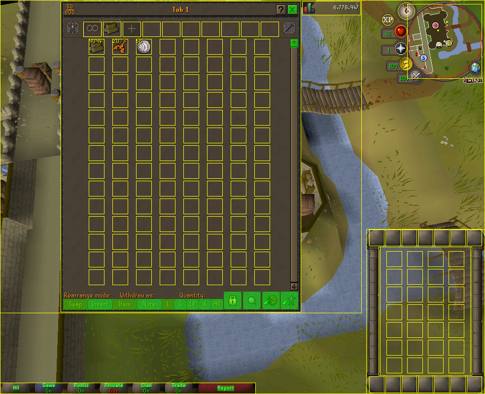
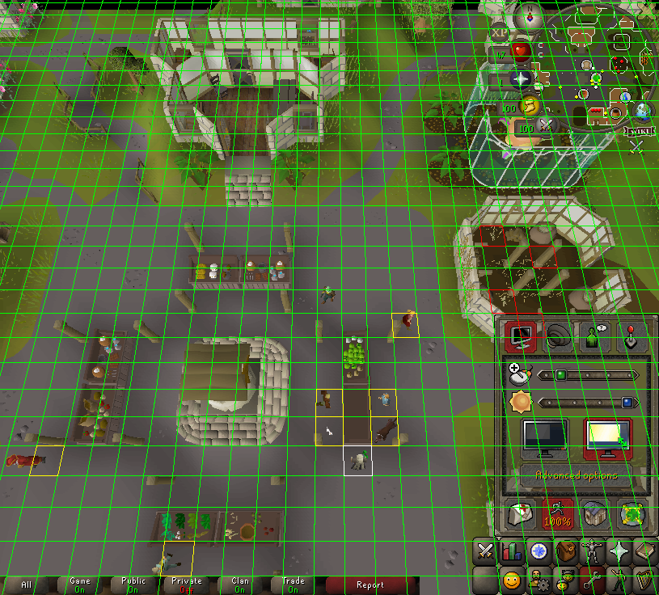
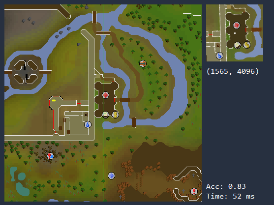
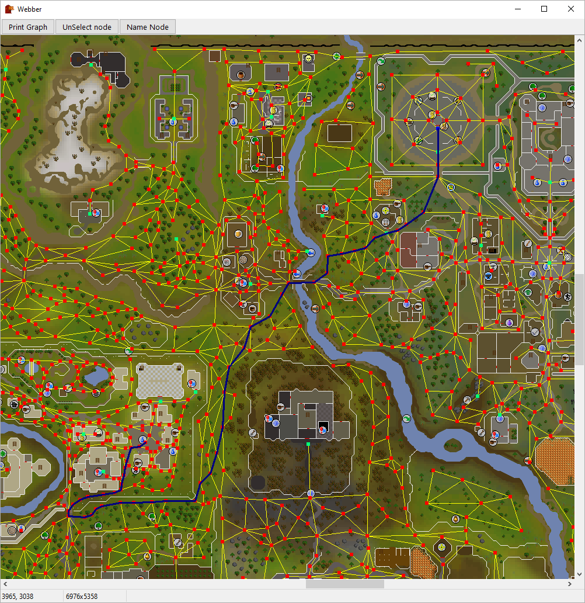

SRL Resource Library
=====================
SRL is a library that provides an API for writing bots in Simba for the game Old School RuneScape.

Documentation is available [here](https://torwent.github.io/SRL-T)

This is the SRL version used by [WaspLib](https://github.com/Torwent/WaspLib) and it's the main one used at [WaspSctipts](https://waspscripts.com).

You can find the official SRL version [here](
https://github.com/Villavu/SRL-Development).
## Features
\
*Resizable mode*

\
*Minimap to mainscreen projection*

\
*Detecting position on the world map*

\
*Web walking system (does not handle obstacles)*
